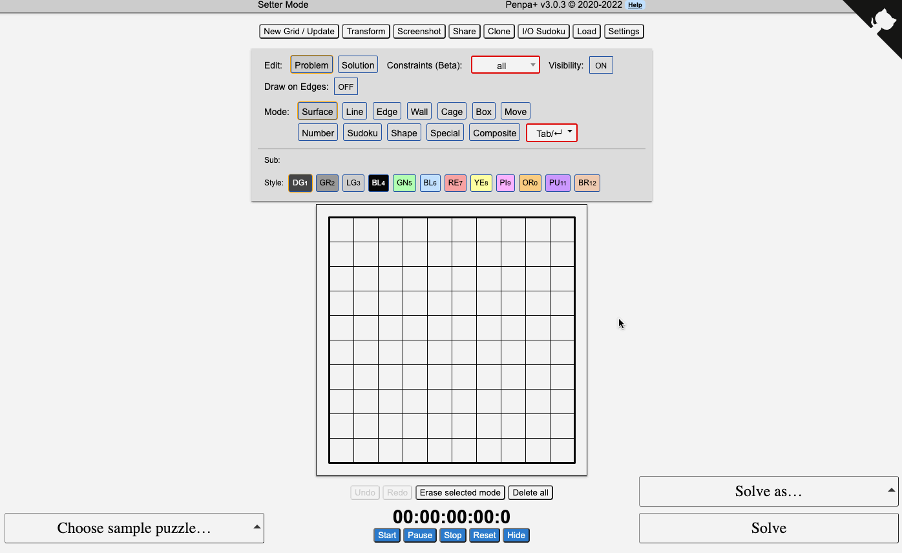

# Nikoli Puzzle Solver

Solver for over 60 types of Nikoli-style logic puzzles, including Sudoku, Slitherlink, Masyu, Nonograms, Skyscrapers, Light Up, Kakuro, and many more, conveniently deployed as a web app for easy use. Try it at https://util.in:8102.

This repository builds on top of the brilliant puzzle solver library [Grilops](https://github.com/obijywk/grilops). Some puzzle implementations are taken or inspired/improved from the [Grilops examples](https://github.com/obijywk/grilops/tree/master/examples), and others are new.

The app hooks up to the [Penpa UI](https://github.com/swaroopg92/penpa-edit) to make it easy to input and view puzzles.

## Features

- See [supported\_puzzles.yml](supported_puzzles.yml) for a list of supported puzzles
- Supports unique solution checking
- Supports irregularly shaped grids and grids with holes when appropriate for the puzzle type
- Supports hexagonal and triangular grids when appropriate for the puzzle type
- Easy for someone with programming experience to modify solvers for puzzle variants, or add new solvers

## Instructions

- Go to https://util.in:8102.
- Input a puzzle, or choose a sample puzzle from the list on the bottom left. (You can also click Load to load any Penpa URL from the web.)
- In the dropdown menu on the bottom right, select the desired puzzle type/rules to solve with.
- Click "Solve". The grid will be automatically filled if a solution is found. Requests on the demo server will time out if no solution is found in 30 seconds. If you have a puzzle that can't be solved in 30 seconds, follow the instructions below to run this application on your own computer.

## Development

### One-time setup

Install [Poetry](https://python-poetry.org/docs/), Python's dependency manager.

Run the following:

    git clone https://github.com/kevinychen/nikoli-puzzle-solver.git
    cd nikoli-puzzle-solver
    poetry install  # note: building the z3 library may take a long time, up to 20 min on some machines
    git submodule update --init

### Running the server

In the root directory, run:

    poetry run flask --debug run

Then go to http://localhost:5000.

### Adding a solver

- Implement a new subclass of [AbstractSolver](solvers/abstract_solver.py) in the [solvers](solvers) directory.
- Update [supported\_puzzles.yml](supported_puzzles.yml) with the puzzle type, and a sample puzzle and its solution.
    - You can construct the sample puzzle in Penpa, and click "Share" -> "Editing URL" to get the encoded puzzle.
    - The name of the subclass of AbstractSolver must be the same as the puzzle type string, with non-alpha letters removed.
- Run the tests with `poetry run pytest` to verify the new solver implementation and sample puzzle are correct.

